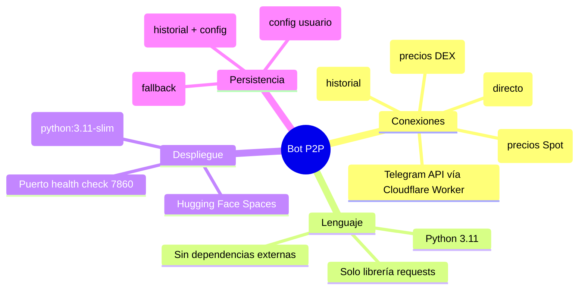
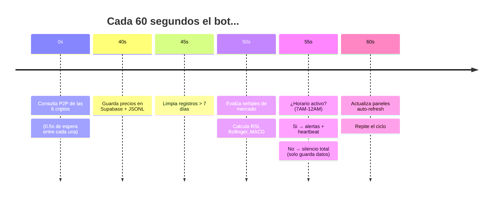
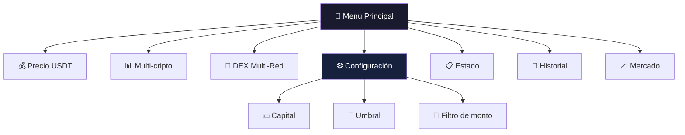
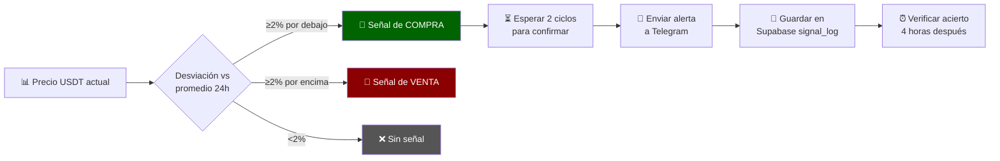
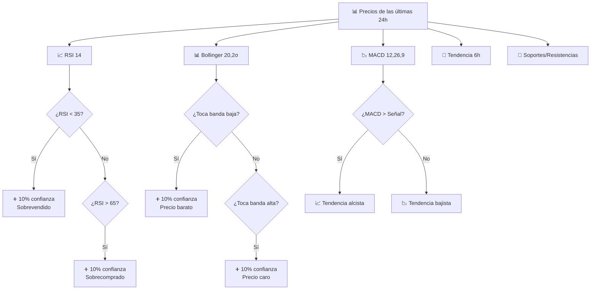
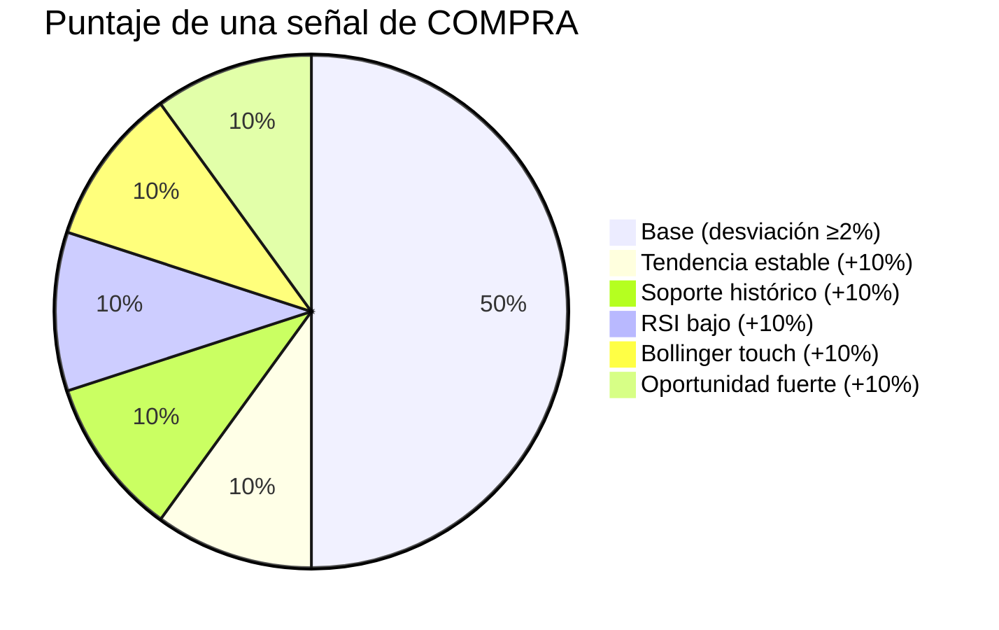
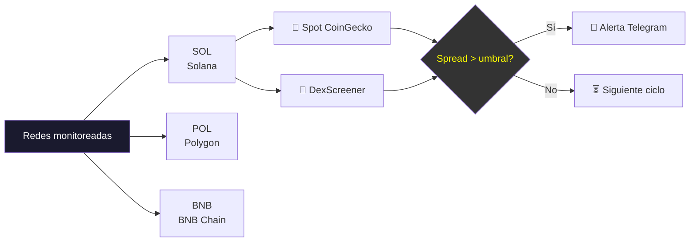
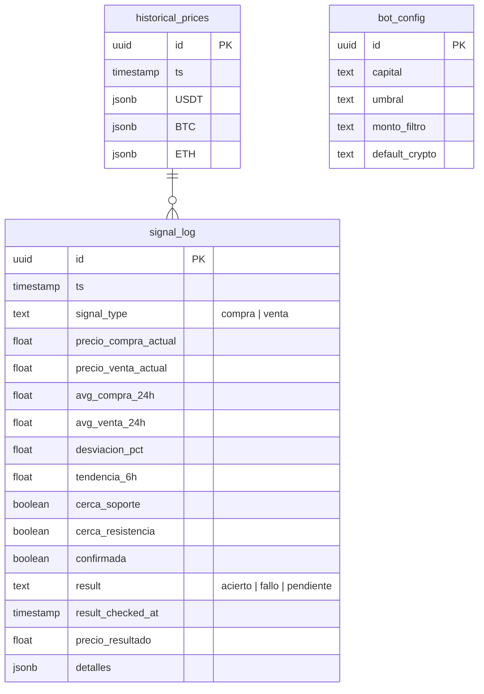
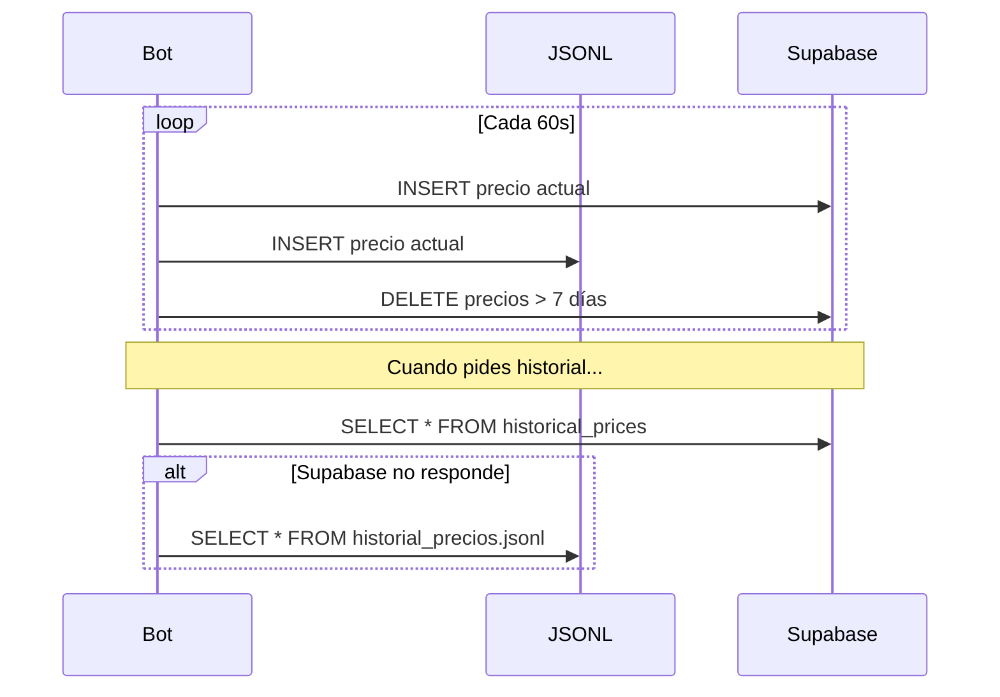

# 🚀 Bot P2P Binance Venezuela — Guía Visual

> Copia cualquier sección en Gemini y dile: *"Crea una diapositiva con esto"*

---

## 📑 Índice de diapositivas

| # | Slide | Tema |
|---|-------|------|
| 1 | ⚙️ | Arquitectura del Bot |
| 2 | 🤖 | Loop Principal (cada 60s) |
| 3 | 💰 | Menú de Telegram |
| 4 | 📈 | Sistema de Señales de Mercado |
| 5 | 🔬 | Indicadores Técnicos |
| 6 | 🧮 | Cálculo de Confianza |
| 7 | 🌌 | DEX Multi-Red |
| 8 | 🕐 | Horario Silencioso |
| 9 | 🗄️ | Supabase |
| 10 | ⚡ | Comandos Rápidos |

---

## 🎬 Slide 1: Arquitectura



**📝 Para la diapositiva:** El bot es un script Python que corre 24/7 en Hugging Face Spaces. Monitorea 6 criptos (USDT, BTC, ETH, BNB, USDC, SOL) en el mercado P2P de Binance y alerta por Telegram cuando hay oportunidades de arbitraje.

---

## 🔄 Slide 2: Loop Principal



**📝 Para la diapositiva:** El bot ejecuta un loop infinito. Cada minuto consulta los precios, guarda el historial, evalúa si hay oportunidad de compra/venta y actualiza los mensajes de Telegram. Entre 12AM y 7AM (hora Venezuela) no envía alertas para no molestar.

---

## 💰 Slide 3: Menú Telegram



| Botón | ¿Qué pasa cuando lo tocas? |
|-------|---------------------------|
| **💰 Precio** | Muestra compra/venta/margen de la cripto predeterminada (USDT). Se actualiza solo cada 60s. |
| **📊 Multi-cripto** | Lista las 6 criptos ordenadas por margen, de mejor a peor. Cada una es un botón. |
| **🌌 DEX Multi-Red** | Compara precio Spot (CoinGecko) vs DEX (DexScreener) en SOL, POL, BNB. |
| **💵 Capital** | Te pregunta cuánto capital tienes (en USD). Se guarda en HF Secrets. |
| **🎯 Umbral** | Cambia el % mínimo para recibir alertas (ej: 0.8% → alerta solo si el margen supera 0.8%). |
| **🛒 Filtro** | Cambia entre Mayorista / $5 / $10 / $20 según el monto de los anuncios P2P. |
| **📋 Estado** | Resumen completo: capital actual, umbral, margen de todas las criptos. |
| **📅 Historial** | Resume el día: precio mínimo, máximo y promedio de cada cripto. |
| **📈 Mercado** | Señal de timing: ¿está barato o caro el USDT hoy? |
| **🔄 Actualizar** | Vuelve al menú principal. |

---

## 📈 Slide 4: Sistema de Señales



### ¿Qué es una "señal"?

Es una alerta que te dice: **"El USDT está barato, es buen momento para comprar"** o **"El USDT está caro, es buen momento para vender"**. No es una orden, es un consejo basado en datos.

### Reglas de emisión

| Regla | Detalle |
|-------|---------|
| **Umbral mínimo** | El precio debe desviarse ≥2% del promedio de 24h |
| **Confirmación** | Espera ~2 minutos (2 ciclos) para confirmar que no fue ruido |
| **Cooldown** | Máximo 1 alerta del mismo tipo por hora |
| **Horario** | Solo entre 7AM y 12AM (hora Venezuela) |

---

## 🔬 Slide 5: Indicadores Técnicos



### Explicación simple

| Indicador | Traducción al español |
|-----------|----------------------|
| **RSI < 35** | "El mercado está barato, mucha gente vendió por miedo" |
| **RSI > 65** | "El mercado está caro, mucha gente compró por euforia" |
| **Tocar banda Bollinger baja** | "El precio tocó piso estadístico, suele rebotar" |
| **Tocar banda Bollinger alta** | "El precio tocó techo estadístico, suele bajar" |
| **MACD alcista** | "La tendencia de corto plazo va para arriba" |
| **Tendencia 6h estable** | "No está cayendo más, es seguro comprar" |

---

## 🧮 Slide 6: Cálculo de Confianza



### Fórmula visual

```
50%  ← Precio bajo vs promedio 24h (requisito base)
+10% ← La tendencia dejó de caer (estable o subiendo)
+10% ← Estás cerca de un soporte histórico conocido
+10% ← RSI confirma que está sobrevendido
+10% ← Bollinger confirma que tocó piso
+10% ← La desviación es fuerte (>3%)
─────
100% ← Señal sólida, puedes actuar con confianza
```

### ¿Cómo interpretar?

| Confianza | Acción recomendada |
|-----------|-------------------|
| **50-60%** | "Hay señal, pero espera confirmación" |
| **70-80%** | "Buen momento para operar" |
| **90-100%** | "Oportunidad clara, actúa" |

---

## 🌌 Slide 7: DEX Multi-Red



### ¿Qué detecta?

Busca diferencias entre el precio "real" del activo (Spot, CoinGecko) y el precio al que se puede vender en exchanges descentralizados (DexScreener).

### ¿Por qué 3 redes?

| Red | DEX usado | Comisión aprox |
|-----|-----------|---------------|
| Solana | Jupiter / Orca | < $0.01 |
| Polygon | QuickSwap / SushiSwap | < $0.05 |
| BNB Chain | PancakeSwap | < $0.10 |

Cada red tiene su propio par USDC/USDT con mayor liquidez. Usa el mismo umbral configurable.

---

## 🕐 Slide 8: Horario Silencioso

```mermaid
gantt
    title Horario del Bot (Hora Venezuela UTC-4)
    dateFormat HH:mm
    axisFormat %H:%M

    section Actividad
    🟢 Modo activo (alertas ON)    :active, 07:00, 17h
    🔴 Modo silencioso (alertas OFF) :silent, 00:00, 7h

    section Funciones
    Monitoreo 24/7                 :monitor, 00:00, 24h
    Botones Telegram 24/7          :buttons, 00:00, 24h
```



### ¿Qué pasa en cada modo?

| | 🟢 Activo (7AM-12AM) | 🔴 Silencioso (12AM-7AM) |
|--|----------------------|------------------------|
| Monitoreo | ✅ Sí | ✅ Sí (solo guarda datos) |
| Alertas de margen | ✅ Sí | ❌ No |
| Heartbeat | ✅ Cada ~30 min | ❌ No |
| Señales de mercado | ✅ Sí | ❌ No |
| Botones | ✅ Sí | ✅ Sí |
| Al cambiar a activo... | — | Envía "¡Buenos días!" |

---

## 🗄️ Slide 9: Supabase

### Tablas



### ¿Qué se guarda dónde?

| Tabla | Datos | Retención |
|-------|-------|-----------|
| `historical_prices` | Precios de todas las criptos cada 60s | 7 días |
| `bot_config` | Capital, umbral, filtro, cripto default | Indefinido |
| `signal_log` | Señales de mercado emitidas + su resultado | Indefinido |

### Flujo de datos



---

## ⚡ Slide 10: Hoja de Referencia Rápida

### Cálculos clave

```
Margen neto = ((venta - compra) - comisiones) / compra × 100
Comisiones totales = 0.25% compra + 0.25% venta + 0.30% pago móvil = 0.80%
Ganancia USD = capital × (margen / 100)
Ganancia VES = ganancia_usd × tasa_venta_USDT
```

### Umbrales recomendados

| Modo | Umbral | ¿Cuándo alerta? |
|------|--------|----------------|
| 🟢 Conservador | 1.0% | Solo oportunidades claras |
| 🟡 Normal | 0.8% | Balance riesgo/oportunidad |
| 🔴 Agresivo | 0.5% | Más alertas (menos precisas) |

### Capital mínimo

| Tipo | Mínimo | Nota |
|------|--------|------|
| Maker activo | $100 USD | Para publicar anuncios en Binance |
| Taker | $0 | Solo comprar al mejor precio disponible |
| Análisis | $0 | Puedes usar el bot solo para ver datos |

### Variables de entorno (HF Secrets)

| Nombre | Ejemplo |
|--------|---------|
| `TELEGRAM_TOKEN` | `8656204241:AAFuDd...` |
| `TELEGRAM_CHAT_ID` | `591442241` |
| `CLOUDFLARE_PROXY` | `https://ves-arbitraje-p2p.kelvinyohan14.workers.dev` |
| `USE_PROXY` | `true` |
| `CAPITAL` | `90` |
| `UMBRAL` | `0.8` |
| `MONTO_FILTRO` | (Mayorista / $5 / $10 / $20) |
| `DEFAULT_CRYPTO` | `USDT` |
| `SUPABASE_URL` | `https://wmedwtgfjjkmflfbftxs.supabase.co` |
| `SUPABASE_KEY` | (key secreta) |
| `HF_TOKEN` | (token de Hugging Face) |

---

## 📖 Glosario: De técnico a español

| Término | Traducción | Explicación |
|---------|------------|-------------|
| **P2P (Peer to Peer)** | Persona a persona | Mercado donde tú le compras/vendes directamente a otra persona, no a Binance |
| **Maker** | Creador de orden | Pones un anuncio de compra/venta y esperas a que alguien te acepte. Ganas menos comisión (0.25%) |
| **Taker** | Tomador de orden | Aceptas el anuncio de alguien más. Pagas más comisión (~1%) |
| **Spread** | Diferencia | La distancia entre el precio de compra y el de venta. Si compra=780 y venta=800, el spread es 20 Bs (~2.5%) |
| **Margen neto** | Ganancia real | Lo que realmente te queda después de restar comisiones al spread |
| **Arbitraje** | Comprar barato, vender caro | Compras USDT al precio más bajo disponible y lo vendes al precio más alto, en el mismo momento |
| **Capital** | Tu dinero | Cuánto dinero en USD tienes disponible para operar |
| **Umbral** | Límite mínimo | El % de ganancia mínimo que te interesa. Si el umbral es 0.8%, solo te alerta cuando el margen supera 0.8% |
| **PayTypes** | Métodos de pago | Los bancos o métodos que filtras en los anuncios P2P (Banco de Venezuela, Pago Móvil, etc.) |
| **Spot** | Precio al contado | El precio de mercado actual de una cripto en exchanges centralizados (Binance, Coinbase) |
| **DEX** | Exchange descentralizado | Un exchange sin dueño, manejado por código (smart contracts). Ej: Jupiter en Solana, PancakeSwap en BNB |
| **Liquidez** | Cuánto hay disponible | Si hay mucha liquidez, puedes comprar/vender grandes cantidades sin que el precio se mueva |
| **RSI** | Fuerza de la tendencia | Mide de 0 a 100 si el mercado está "cansado" de subir (sobrecomprado) o "cansado" de bajar (sobrevendido) |
| **Bollinger Bands** | Bandas de precio | Tres líneas: media, techo y piso. Cuando el precio toca el techo está caro, cuando toca el piso está barato |
| **MACD** | Cruce de medias | Dos líneas que se cruzan: cuando una cruza arriba de la otra, la tendencia va para arriba. Si cruza abajo, va para abajo |
| **Soporte** | Piso histórico | Un precio al que el mercado suele rebotar hacia arriba. Como un colchón |
| **Resistencia** | Techo histórico | Un precio al que el mercado suele rebotar hacia abajo. Como un techo de vidrio |
| **Tendencia** | Dirección del mercado | ¿Está subiendo (alcista), bajando (bajista) o quieto (lateral)? |
| **Desviación** | Qué tan lejos de lo normal | Si el promedio de 24h es 780 y el precio actual es 760, la desviación es -2.5% (está más barato de lo normal) |
| **Confianza** | Qué tan segura es la señal | 0-100%. Una señal con 90% de confianza tiene muchos indicadores apuntando en la misma dirección |
| **Heartbeat** | Latido del bot | Cada 30 ciclos (~30 min) el bot envía un mensaje de "sigo vivo, esto es lo que veo" |
| **Auto-refresh** | Se actualiza solo | Los mensajes de Telegram se actualizan cada 60s sin que toques nada. Expiran a los 5 minutos |
| **Timeout** | Tiempo de espera máximo | Si Supabase no responde en 5 segundos, el bot sigue adelante sin esperar |
| **Thread** | Hilo de ejecución | El bot corre en un hilo secundario para que el health server (hilo principal) siempre responda |
| **Proxy** | Intermediario | El bot no puede hablar directo a Telegram desde HF Spaces, así que usa un Worker de Cloudflare como puente |
| **Health check** | Control de salud | HF Spaces pregunta cada cierto tiempo "¿estás vivo?". El health server responde "OK" para que no reinicien el bot |
| **Polling** | Preguntar cada rato | El bot pregunta a Telegram "¿hay mensajes nuevos?" cada 2-3 segundos |
| **JSONL** | Archivo de historial | Cada línea del archivo `historial_precios.jsonl` es un precio en formato JSON. Un minuto = una línea |
| **Supabase** | Base de datos en la nube | Donde se guarda el historial de precios, la configuración y las señales emitidas |

---

## 🧠 Frases para copiar-pegar en Gemini

### Diapositiva "Arquitectura"
> *"Crea una diapositiva sobre la arquitectura del bot: es un script Python 3.11 con solo la librería requests, corre en Hugging Face Spaces con Docker, se conecta a Binance P2P API, CoinGecko, DexScreener, Telegram vía Cloudflare Worker y guarda datos en Supabase."*

### Diapositiva "Indicadores Técnicos"
> *"Explica estos 3 indicadores como si fueran para principiantes: RSI mide si algo está sobrecomprado o sobrevendido (como un medidor de 0 a 100). Bollinger Bands son bandas de precio: cuando toca la de abajo está barato, cuando toca la de arriba está caro. MACD muestra si la tendencia va para arriba o para abajo."*

### Diapositiva "Sistema de Señales"
> *"Crea una diapositiva sobre un sistema de señales de trading: compara el precio actual de USDT contra su promedio de 24 horas. Si está 2% más barato → señal de compra. Si está 2% más caro → señal de venta. Cada señal tiene un nivel de confianza de 0% a 100% basado en RSI, Bollinger, tendencia y soportes históricos."*

### Diapositiva "Horario Silencioso"
> *"Diseña una diapositiva mostrando que el bot tiene modo silencioso de 12AM a 7AM (hora Venezuela). Durante el día envía alertas y reportes, en la noche solo guarda datos en silencio. A las 7AM saluda con 'Buenos días'."*

---

## 🔧 Troubleshooting

### No llegan los mensajes de Telegram
1. Verifica que `CLOUDFLARE_PROXY` esté configurado en HF Secrets
2. Prueba el worker directamente: `https://ves-arbitraje-p2p.kelvinyohan14.workers.dev/telegram-api/getMe`
3. Si el worker responde pero el bot no, revisa `USE_PROXY=true`

### El bot se reinicia en bucle (HF Spaces)
1. Verifica que `run.py` tenga el health server en el puerto correcto (7860)
2. Revisa logs de HF: busca "Timeout" de Supabase
3. Si Supabase timeout, el bot intenta con fallback a JSONL

### Precios incorrectos
1. CoinGecko puede tener delays de 10-30s en mercado volátil
2. DexScreener muestra el par con mayor liquidez (puede variar)
3. El precio P2P de Binance es siempre el mejor precio de anuncios activos

---

*Última actualización: 26-Jun-2026. SHA: ed46e44*
